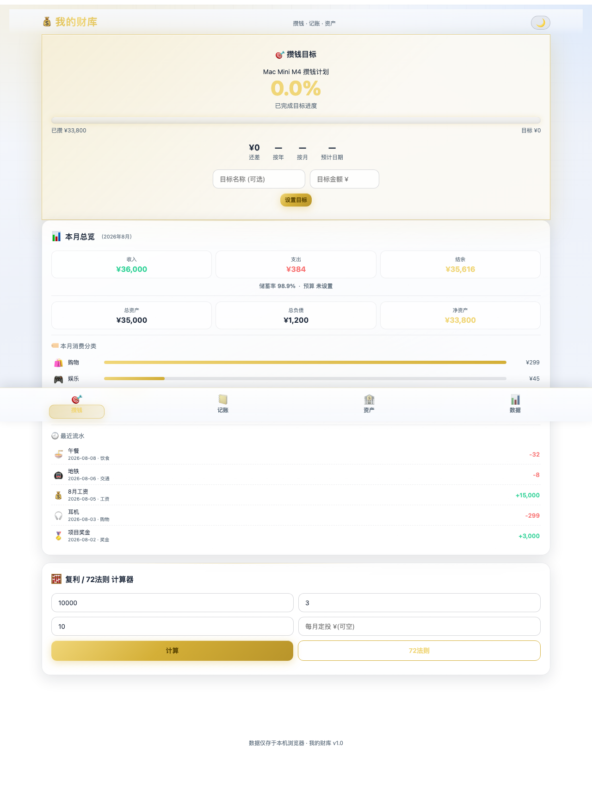
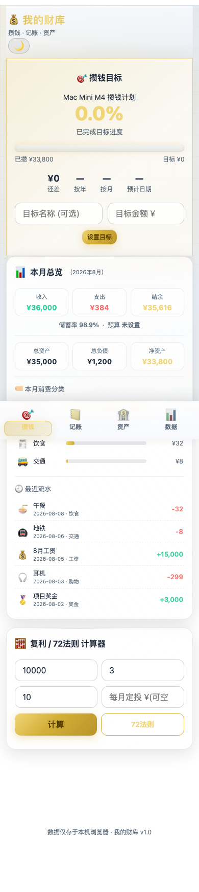

# 💰 我的财库 · 攒钱理财管家

> 纯前端零依赖的本地记账 + 攒钱理财工具。数据全部存本机浏览器，隐私安全，无需注册登录。

**深色金色主题 · 玻璃拟态卡片 · 动效拉满 · PWA 可离线安装**

---

## ✨ 特性

| 模块 | 说明 |
|------|------|
| 🎯 **攒钱目标** | 设目标 + 按**净资产**实时进度，达标自动放烟花 🎆 |
| 📅 **双维度倒计时** | 还差 / **按年**(N年M个月) / **按月**(N.N个月) / 预计日期 |
| 📊 **数据仪表盘** | 本月收入/支出/结余/储蓄率 + 预算进度 + 资产 + 分类 Top5 + 最近流水 |
| 🧮 **复利/72法则计算器** | 复利终值 + 翻倍年限精算 |
| 📒 **随手记账** | 支出/收入 + 分类 + 日期 + 备注，Emoji 选择器 208 个，可弹窗编辑 |
| 🔄 **周期性支出** | 房贷/房租/订阅自动生成账单，防重复 |
| ⚡ **快捷模板** | 一键记常见支出 |
| 📈 **统计分析** | 近6月趋势、分类占比环形图、分类排行、Top消费 🥇🥈🥉、月度对比、净流入趋势、年度12月表 |
| 🏦 **资产/负债/社保** | 多币种；负债还清周期估算器（含利息） |
| 🔒 **PIN 隐私锁** | 加盐 FNV hash，非明文存储 |
| 🌓 **明/暗主题** | 手动偏好 / 跟随系统，一键切换 |
| 📑 **导出** | JSON(可回导) / CSV / Excel，中文不乱码 |
| 📲 **PWA** | Service Worker 离线缓存、安装到桌面、系统通知（预算超支/目标达成） |
| 🎨 **动效** | 粒子背景、卡片3D倾斜、数字跳动、左滑删除、下拉刷新、骨架屏、涟漪、Toast |

## 🖼️ 界面预览

> 🌙 深色金主题 · 首页数据仪表盘（预置演示数据）

**桌面端**



**移动端**



## 🚀 使用

纯静态，任意静态服务器托管即可（无需后端）：

```bash
cd 理财工具
python3 -m http.server 8899
# 打开 http://localhost:8899
```

## 📦 文件结构

```
├── index.html    # 界面 + CSS + 粒子动画
├── app.js        # 全部业务逻辑（含 PWA 注册、PIN 锁）
├── manifest.json # PWA 应用配置
├── sw.js         # Service Worker 离线缓存
└── PROJECT.md    # 项目开发档案（永久记忆库）
```

## 🛡️ 隐私

所有数据仅存于本机浏览器 `localStorage`，**不上传、不联网、不自建账户**，纯本地私密记账。

## 📄 许可

仅供个人使用。
